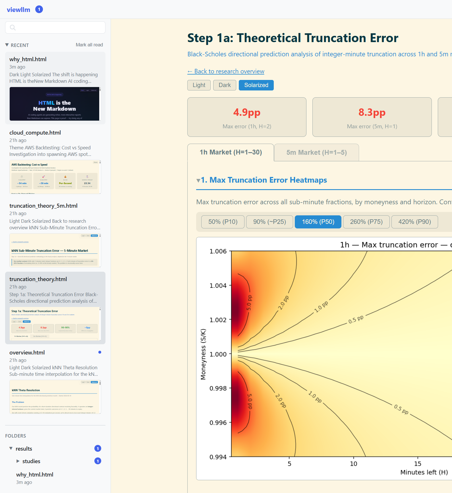
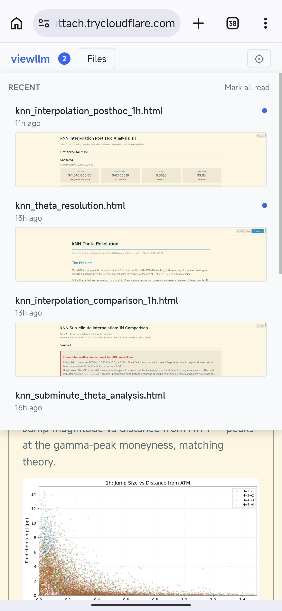

<p align="center">
  
</p>

<h1 align="center">viewllm</h1>

<p align="center">
  <strong>View and share HTML/Markdown reports from AI coding agents.</strong>
</p>

<p align="center">
  Run this in your terminal — no install needed:
</p>

<p align="center">

```bash
npx viewllm@latest
```

</p>

<p align="center">
  <strong><a href="https://demo.viewllm.dev">Live demo →</a></strong>
</p>

<p align="center">
  <sub><a href="https://github.com/yz671/viewllm/releases">Download binary</a> · <a href="https://www.npmjs.com/package/viewllm">npm</a></sub>
</p>

---

> "HTML is the new markdown. I've stopped writing markdown files for almost everything and switched to using Claude Code to generate HTML for me."
>
> — [**Thariq Shihipar**](https://x.com/trq212/status/2052811606032269638), Engineering Lead, Claude Code at Anthropic · 5M+ views

---

## The problem

Claude Code, Codex, and Cursor generate rich HTML reports — data visualizations, research analyses, interactive charts. But there's no good way to view or share them:

- **VS Code Live Preview** breaks over SSH and WSL
- **GitHub** won't render HTML — only Markdown
- **`python -m http.server`** gives you a raw directory listing
- **Sharing** means downloading files and emailing them around

## What viewllm does

Run it in any project folder. You get:

- **Real-time file watching** — new and modified files appear with unread indicators as your agent produces them
- **Sharing** — shareable links to specific reports. Add `-tunnel` for a public URL, no port forwarding needed
- **Per-device unread tracking** — each person who opens the link gets their own read/unread state
- **Search** — file tree, search bar with hover preview, thumbnails, text snippets
- **HTML and Markdown** — renders both. Markdown gets GitHub-style formatting
- **SSH, WSL, remote servers** — works anywhere you have a terminal
- **Themes** — Light, Dark, Solarized

<details>
<summary>Mobile view</summary>
<p align="center">
  
</p>
</details>

## Lightweight

| | |
|---|---|
| **Binary** | 9MB |
| **Memory** | ~7MB |
| **Startup** | ~100ms |
| **API response** | <5ms |
| **Dependencies** | 0 |

Single Go binary. No database, no config files, no background processes. Read-only. Stop it and it's gone.

## Quick start

Ask your AI coding agent:

> *"Write me an HTML report analyzing the architecture of this codebase. Include diagrams, dependency graphs, and your recommendations."*

Then:

```bash
npx viewllm@latest
```

## Install

**npx** (zero install, always latest):
```bash
npx viewllm@latest
```

**Binary** — grab from [GitHub Releases](https://github.com/yz671/viewllm/releases):
```bash
curl -fsSL https://github.com/yz671/viewllm/releases/latest/download/viewllm-linux-amd64 -o viewllm
chmod +x viewllm
./viewllm
```

<details>
<summary>Build from source</summary>

```bash
git clone https://github.com/yz671/viewllm.git && cd viewllm
go build -o viewllm . && ./viewllm
```

</details>

## Sharing

viewllm shows a shareable link on startup:

```
viewllm serving ./reports

  Open: http://192.168.1.42:8090
  To share over the internet, use -tunnel
```

For sharing beyond your network — no accounts, no port forwarding:

```bash
npx viewllm@latest -tunnel
```

```
viewllm serving ./reports — starting tunnel (powered by Cloudflare)...

  Share this link: https://random-words.trycloudflare.com

  Anyone with this link can view your reports.
  This link expires when you stop viewllm — a new one is created each time.
```

## Works with any tool

Works with **Claude Code**, **Codex**, **Cursor**, **Jupyter**, and anything else that outputs `.html` or `.md` files.

## Usage

```
viewllm [directory] [-p port] [-exclude dir]... [-tunnel]
```

Serves the current directory by default. Finds an open port automatically.

| Flag | Default | Description |
|------|---------|-------------|
| `-p` | `8090` | Port to serve on |
| `-exclude` | — | Additional directories to ignore (repeatable) |
| `-tunnel` | off | Create a public URL via Cloudflare Tunnel |

<details>
<summary>Settings</summary>

Click the gear icon to access per-device settings:

- **Show** — toggle HTML and Markdown files on/off
- **Theme** — Light, Dark, Solarized
- **Text preview** — show/hide text snippets
- **Thumbnail preview** — show/hide live mini-renders
- **Recent files count** — 0 (off), 3, 5, 10, 15, or 20
- **Ignored folders** — add/remove custom exclude patterns

All settings stored in localStorage — each device has its own preferences.

</details>

<details>
<summary>API</summary>

```
GET /              → Web UI
GET /api/recent    → Recently modified files (with previews)
GET /api/tree      → Full directory tree as nested JSON
GET /api/excludes  → Current exclude patterns
GET /files/{path}  → Serves HTML directly, renders Markdown as styled HTML
```

</details>

<details>
<summary>Technical details</summary>

Single Go binary with the entire frontend embedded via `go:embed`. Scans for `.html` and `.md` files, serves a web UI, polls for changes every 2 seconds. Markdown rendered client-side with [marked.js](https://github.com/markedjs/marked).

**Stack:** Go stdlib (zero deps) · Vanilla HTML/CSS/JS · `go:embed` · Polling-based file discovery

</details>

## Contributing

The codebase is intentionally simple — two files:

```
main.go              → Server, API, file scanning (~650 lines)
frontend/index.html  → Entire UI, embedded into the binary (~40KB)
```

## License

MIT
